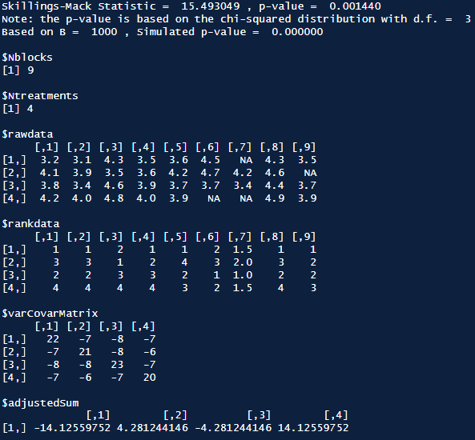
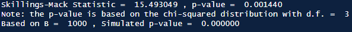
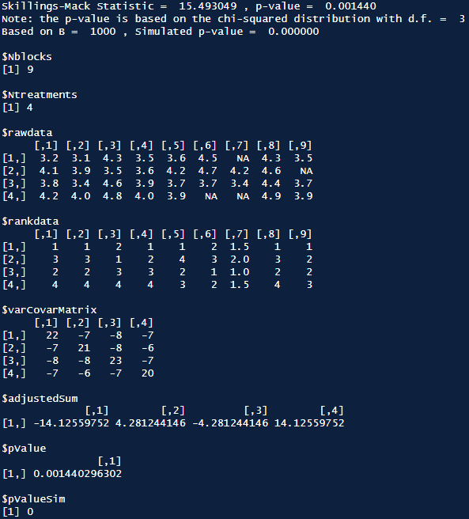

# Skillings.Mack.Suppress

> “A generalization of the statistic used in Friedman’s ANOVA method and
> in Durbin’s rank test. This nonparametric statistical test is useful
> for the data obtained from block designs with missing observations
> occurring randomly. A resulting p-value is based on the chi-squared
> distribution and Monte Carlo method.” - Patchanok Srisuradetchai

## Changes

This repository is a small update to the
[Skillings.Mack](https://github.com/cran/Skillings.Mack "Skillings.Mack CRAN Mirror")
package with the purpose of providing more options for outputting the
results. The original options would print the following;

``` r
Ski.Mack(some_matrix, simulate.p.value = TRUE, B = 1000)
```

[](https://github.com/ZacWarham "Go to author's page")

Whilst useful, if you were to assign the result to a variable you would
still have the same output in your console or markdown. By adding a new
parameter, `suppress = TRUE`, this reduces the output to just the test
statistics results like this;

[](https://github.com/ZacWarham "Go to author's page")

This is particularly useful when trying to knit a document with a very
large matrix or if you have to run similar tests multiple times. Instead
of hiding the entire output, you just see the test statistics results.

A further addition was to include the *p-value* and *Simulated p-value*
in the output list so they can be accessed when stored in a variable.

``` r
some_result <- Ski.Mack(some_matrix, simulate.p.value = TRUE, B = 1000, suppress = TRUE)
#> 
#> Skillings-Mack Statistic =  15.493049 , p-value =  0.001440 
#> Note: the p-value is based on the chi-squared distribution with d.f. =  3 
#> Based on B =  1000 , Simulated p-value =  0.000000

some_result$pValue
#>                [,1]
#> [1,] 0.001440296302
some_result$pValueSim
#> [1] 0
```

[](https://github.com/ZacWarham "Go to author's page")

## Installation

This package can be installed from
[GitHub](https://github.com/ZacWarham/Skillings.Mack) with:

``` r
# install.packages("devtools")
devtools::install_github("ZacWarham/Skillings.Mack")
```

Once installed this release should be fully compatible with all working
code from the original release. To reduce the output you just need to
add the `suppress = FALSE` parameter. Both additional values should
automatically be included in any assigned variables. If there are any
problems please create an issue in this repository.
